# DocSpot - Hospital Management System

DocSpot is a full-stack hospital management system designed to streamline patient, doctor, and appointment workflows through an intuitive web-based platform.

## About the Project

This project was developed as a major academic project to simplify hospital management activities through a web-based system. It supports multiple roles including Patient, Doctor, and Admin with dedicated functionalities for each.

## Tech Stack

* **Frontend:** React, TypeScript, JavaScript, HTML, CSS
* **Backend:** Django, Python
* **Database:** SQLite
* **Tools:** Git, GitHub, VS Code

## Key Features

* User / Patient Management
* Doctor Management
* Appointment Booking System
* Doctor Weekly Schedule Management
* Patient Medical History Tracking
* Admin Dashboard for Data Control
* Doctor Dashboard with Patient & Appointment Handling
* Responsive and user-friendly UI

## Project Structure

```text
DocSpot-Hospital-Management-System/
│
├── screenshots/
├── frontend/
├── carespot/
├── customadmin/
├── user/
├── media/
├── docs/
├── manage.py
├── requirements.txt
├── db.sqlite3
└── README.md
```

## How to Run the Project

### Run Full Project (Frontend + Backend)

```bash
cd frontend
npm run dev
```

> This command runs both frontend and backend together as configured in the project.

## Screenshots

Below are some key features and UI views of the system:

### Patient Side

#### Home

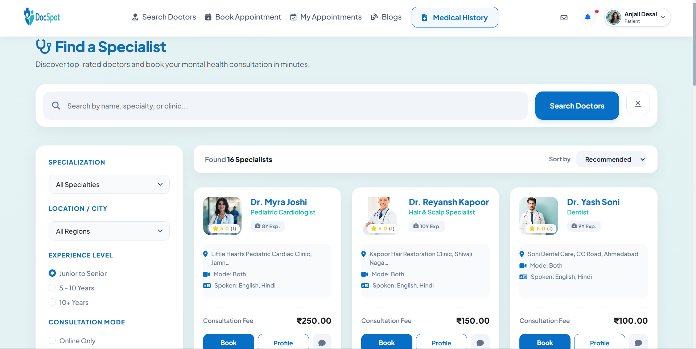

#### Doctor Profile

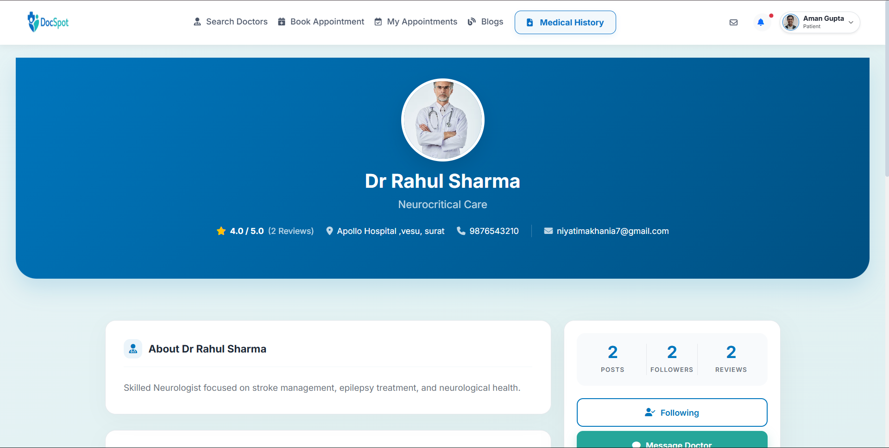

#### Book Appointment

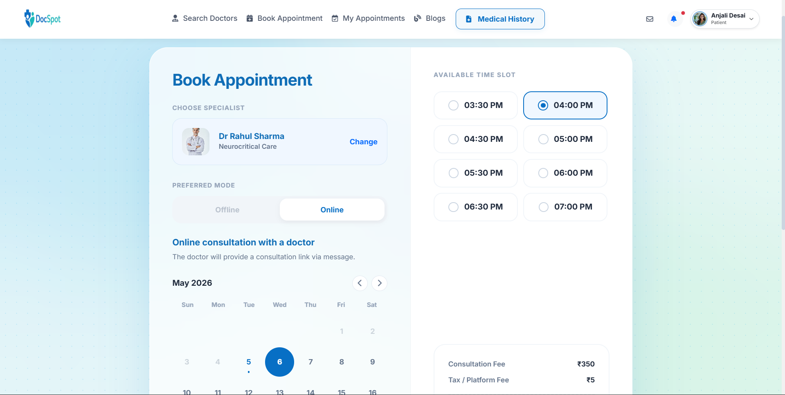

#### Medical History

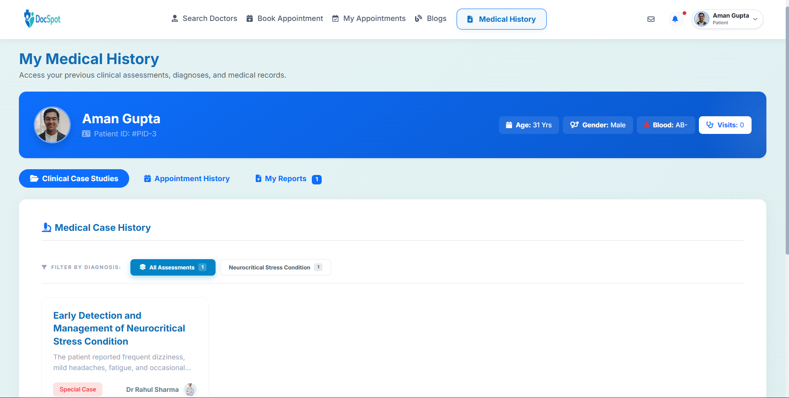

---

### Doctor Dashboard

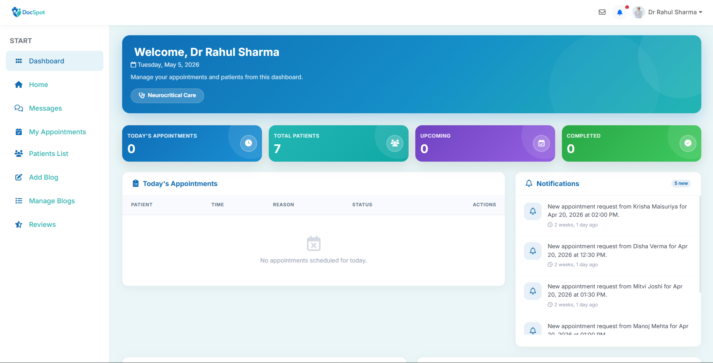

### Manage Appointments (Doctor)

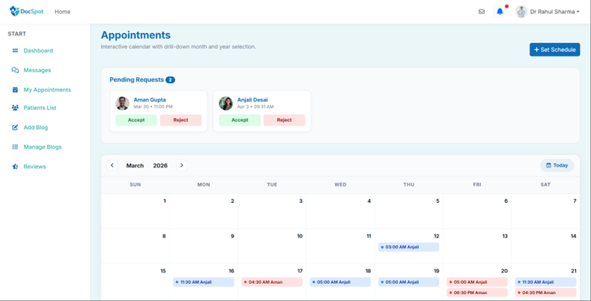

### Patients List

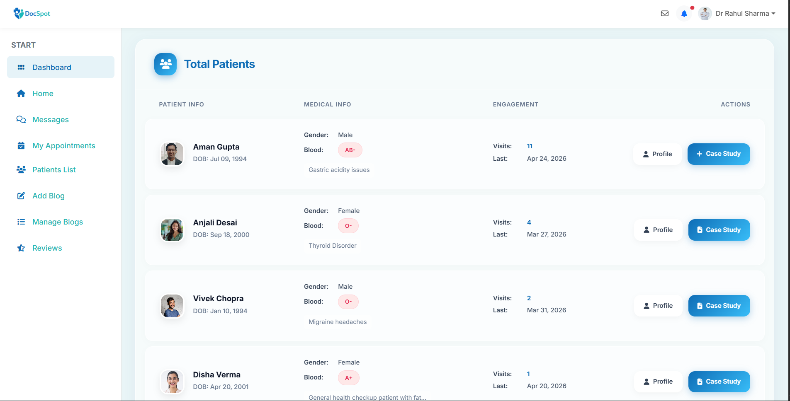

### Case Study / Clinical Notes

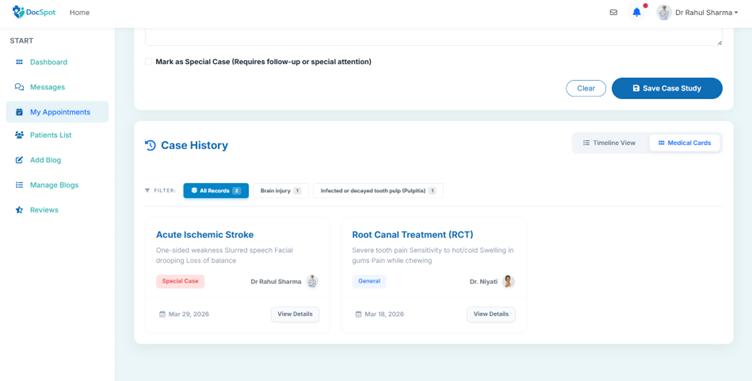

---

### Admin Dashboard

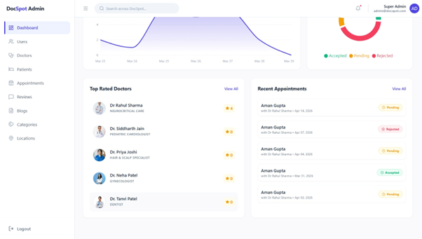

### Doctor Management

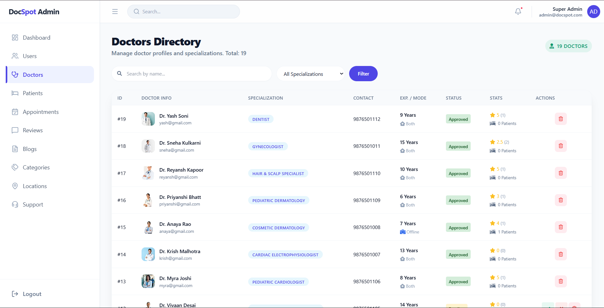

### Appointment Management

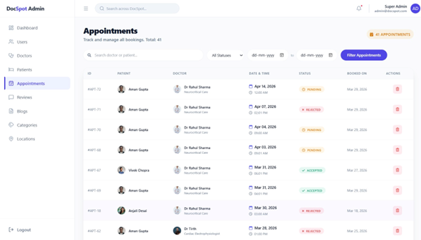

## Documentation

Additional documentation is available in the `docs/` folder, including development guidelines and reference materials related to the project.

## Author

**Henny Mahuvagara**
GitHub: https://github.com/henny-mahuvagara
